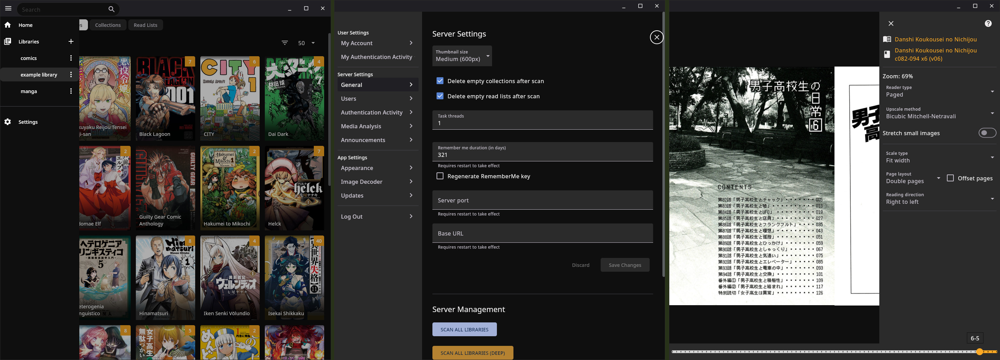

# Komelia - Komga media client

### latest version available at https://github.com/Snd-R/Komelia/releases

## Requires libvips and its dependencies for image decoding

The recommended way to build is by using docker images that contain all required build dependencies\
If you want to build with system toolchain and dependencies go to `./image-decoder/native` and
run `build-(target-paltform).sh` script for your target paltform

To build with docker container, replace <*platform*> placeholder with your target platform\
Available platforms include: `linux-x86_64`, `windows-x86_64`, `android-arm64`, `android-x86_64`

- `docker build -t komelia-build-<platfrom> . -f ./cmake/<paltform>.Dockerfile `
- `docker run -v .:/build komelia-build-<paltform>`
- `./gradlew <platform>_copyJniLibs` - copy built shared libraries to resource directory that will be
  bundled with the app

# Desktop App Build

Requires jdk 17 or higher

- `./gradlew :komelia-app:run` to launch desktop app
- `./gradlew :komelia-app:repackageUberJar` package jar for current OS (output in `komelia-app/build/compose/jars`)
- `./gradlew :komelia-app:packageReleaseDeb` package Linux deb file (output in `komelia-app/build/compose/binaries`)
- `./gradlew :komelia-app:packageReleaseMsi` (can only be run under Windows) package Windows msi installer (output
  in `komelia-app/build/compose/binaries`)

# Android App Build

- debug apk build:`./gradlew :komelia-app:assemble` (output in `komelia-app/build/outputs/apk/debug`)
- unsigned release apk build:`./gradlew :komelia-app:assembleRelease` (output in `komelia-app/build/outputs/apk/release`)